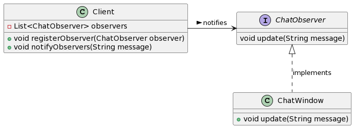

# Проект SibFULanChat
Автор: Савельев Александр Вячеславович КИ22-16\1б
## Описание
Этот проект был выполнен в рамках курса "Проектирование программного обеспечения". Он представляет собой реализацию чат-сервера и чат-клиента на Java, демонстрируя применение паттернов дизайна и принципов SOLID.

В программе используется простейшее шифрование с помощью шифра Цезаря.


## Запуск

### Запуск сервера
1. Запустите `Server.jar` .
2. Или запустите файл `Server.java`.

Это активирует сервер, который начнет принимать подключения клиентов.

### Подключение клиента
1. Запустите `Client.jar` файл для каждого клиента.
2. Или запустите файл `Client.java`.

После запуска введите имя пользователя и подключитесь к серверу.

## Соблюдение принципов SOLID

### Single Responsibility Principle
Каждый класс в проекте выполняет строго определенную функцию. Например, `Server` обрабатывает подключения клиентов, а `ClientHandler` управляет взаимодействием с отдельными клиентами.

### Open/Closed Principle
Классы проектировались так, чтобы быть открытыми для расширения, но закрытыми для модификации. Например, система шифрования реализована так, что можно легко добавить новые методы шифрования без изменения существующего кода.

### Liskov Substitution Principle
Все классы-наследники могут служить заменой для их родительских классов. Например, любой класс, реализующий `IMessageEncryptor`, может использоваться взаимозаменяемо.

### Interface Segregation Principle
Интерфейсы в проекте не перегружены лишними методами, которые не используются их реализациями.

### Dependency Inversion Principle
Высокоуровневые модули, такие как `Client` и `ClientHandler`, зависят от абстракций, а не от конкретных реализаций. Это видно в использовании интерфейса `IMessageEncryptor` для шифрования сообщений.

## Паттерн Наблюдатель

Паттерн Наблюдатель используется для обновления интерфейса пользователя в реальном времени при получении новых сообщений. Например:

```java
public class Client {
 private List<ChatObserver> observers = new ArrayList<>();

 public void registerObserver(ChatObserver observer) {
     observers.add(observer);
 }

 private void notifyObservers(String message) {
     for (ChatObserver observer : observers) {
         observer.update(message);
     }
 }
 
}
```




Когда Client получает сообщение, он уведомляет всех своих наблюдателей (ChatObserver), вызывая у них метод update.

## Паттерн, который не стоило бы применять: Прототип (Prototype)

Паттерн Прототип предназначен для создания новых объектов путем копирования существующих. В контексте нашего чат-приложения, где каждый экземпляр клиента и сервера уникален и имеет свои особенности (состояние подключения, список подключенных пользователей и т.д.), использование Прототипа нецелесообразно. Копирование таких объектов может привести к непредвиденным проблемам, таким как дублирование состояний подключений, что может нарушить логику работы приложения.
